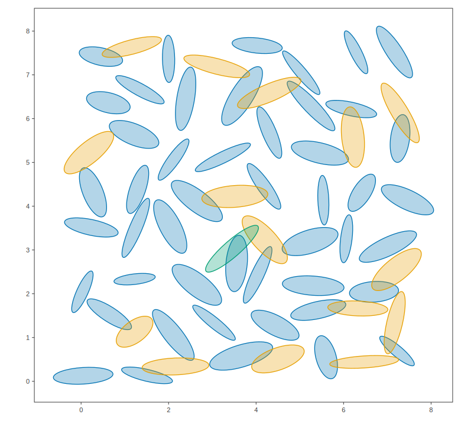

# etree

**Exact intersection tests for ellipsoids and friends.**
Points, boxes, balls, ellipsoids, and simplices in R^d; single pairs,
tree-accelerated queries, and tree-vs-tree sweeps. Header-only C++17 with
Python bindings; Eigen is the only dependency.

<p align="center">

</p>

*A family of anisotropic ellipsoids partitioned into batches of mutually
non-overlapping members ([example](docs/examples/batch_picking.md)). The figures throughout
are 2D because the built-in visualization is 2D; the library itself is
dimension-generic.*

## The design in one idea

etree is organized around a small closed system:

**Objects.** Five geometric types — `point`, `Box`, `Ball`, `Ellipsoid`,
`Simplex`. A `Simplex` may be
lower-dimensional (a point, segment, or triangle embedded in R^d). Two more
types participate as queries only: `Segment` and `Halfspace`.

**Trees over each type.** `BoxTree`, `BallTree`, `EllipsoidTree`, and
`SimplexTree` index a family of objects for logarithmic-time queries
(`SimplexMesh` adds mesh connectivity on top of a cell tree; a point cloud
is a `BallTree` with zero radii).

**Intersections at three levels**, all built from one table of exact
pairwise tests:

| level | call | what you get |
| --- | --- | --- |
| object × object | `intersects(A, B)` | one exact test |
| tree × object | `tree.collisions(B)` | every member of a family intersecting `B` |
| tree × tree | `collision_pairs(T1, T2)` | every intersecting pair between two families, in one simultaneous descent of both trees |

The diagonal of the third level is self-collision
(`tree.self_collision_pairs()`), which yields the overlap graph of a family:
the input to [batch picking](docs/examples/batch_picking.md). Tree × tree
over two meshes' cell trees is [mesh × mesh collision](docs/examples/mesh_mesh.md),
the kernel of supermeshing.

## The intersection table

The algorithm behind each cell of `intersects` (all exact; solver-backed
cells to documented tolerance). See the
[visual gallery of every pair](docs/examples/intersections_gallery.md).

| ∩ | point | `Box` | `Ball` | `Ellipsoid` | `Simplex` |
| --- | --- | --- | --- | --- | --- |
| **point** | — | coordinate bounds | distance | Mahalanobis test (LDLT) | barycentric solve |
| **`Box`** | | interval overlap | clamped closest point | projected coordinate-descent QP | phase-I LP |
| **`Ball`** | | | center distance | Gilitschenski–Hanebeck with Σ = r²I | face-enumeration projection (Euclidean) |
| **`Ellipsoid`** | | | | generalized eigenproblem + 1D minimization (Gilitschenski–Hanebeck) | face-enumeration projection in the Σ⁻¹ metric |
| **`Simplex`** | | | | | phase-I LP (convex hull vs convex hull) |

Query-only columns: a `Segment` is tested by the slab method (box),
projection (ball), a 1D quadratic (ellipsoid), or coordinate intervals
(simplex); a `Halfspace` is a closed-form support-function comparison
against everything.

Conventions: ellipsoids are E(τ) = {x : (x−μ)ᵀ Σ⁻¹ (x−μ) ≤ τ²} with Σ
symmetric positive definite and the scale τ passed at call time. All objects
are solid and closed, so touching counts as intersecting. Tree queries prune
conservatively (an ellipsoid query uses a bounding-box test and then the
exact ellipsoid-box QP on survivors), so acceleration never changes answers.

## Beyond intersections

- **Simplicial meshes** (`SimplexMesh`): point location with barycentric
  coordinates, closest boundary point, CG1 finite element evaluation,
  [mesh × ellipsoid](docs/examples/mesh_queries.md) and
  [mesh × mesh](docs/examples/mesh_mesh.md) queries.
- **Supporting cast**: k-nearest-neighbor `KDTree`, axis-alternating
  `geometric_sort`, greedy non-overlapping
  [ellipsoid batch picking](docs/examples/batch_picking.md).
- **Optional zero-dependency 2D visualization** (`etree/plot2d.hpp`):
  SVG and PNG figures of objects, trees, queries, and CG1 fields. Every
  figure in the documentation is drawn with it.

## Quick start

```cpp
#include "etree/etree.hpp"
using namespace etree;

Ellipsoid A{mu_a, Sigma_a}, B{mu_b, Sigma_b};
bool overlap = intersects(A, B, /*tau=*/1.0);

EllipsoidTree tree(family_of_ellipsoids, /*tau=*/1.0);
std::vector<int> hits = tree.collisions(some_box);
auto batches = pick_ellipsoid_batches(tree);
```

## Installing

**C++** — three equivalent routes, all ending in `target_link_libraries(your_target PRIVATE etree::etree)`:

- vendor or FetchContent this repo and `add_subdirectory(ellipsoid_tree)`;
- or install it: `cmake -S . -B build && cmake --install build --prefix <prefix>`,
  then `find_package(etree REQUIRED)` from any project with `<prefix>` on
  `CMAKE_PREFIX_PATH`;
- or just add `include/` to your include path (header-only; Eigen required).

Eigen is found via `find_package(Eigen3)`, with an automatic pinned download
as fallback when building this repo standalone.

**Python** — `pip install .` (or `pip install git+https://github.com/NickAlger/ellipsoid_tree`)
builds the `etree` module via scikit-build-core; points are rows (`(n, d)`
arrays, scipy-style), and figures render inline in Jupyter. Alternatively,
build the module without pip via
`cmake -B build -DETREE_BUILD_PYTHON=ON && cmake --build build --target etree_python`.

## Compile-time and memory

etree is header-only but includes Eigen, so every translation unit that
includes an etree header pays Eigen's compile cost — roughly 1.5 s and ~180 MB
of RAM per file (a precompiled header cuts that to ~0.2 s and ~125 MB). This is
normal for an Eigen-based library, but it adds up if you include etree in many
files. On a memory-limited machine, don't over-parallelize the build: keep at
least ~1 GB of RAM per compile job (for example `cmake --build . -j N` with N no
larger than your RAM in GB), or set up a precompiled header on your side.

## Examples ("show, don't tell")

Every page in [`docs/examples/`](docs/README.md) is a complete program, its
actual output, and the figures it draws, which are regenerated from the code by
`docs/generate_examples.py` and checked in CI:

- [Pairwise intersection tests, visually](docs/examples/intersections_gallery.md)
- [Which points of a cloud does an ellipsoid cover?](docs/examples/point_cloud.md)
- [EllipsoidTree spatial queries](docs/examples/ellipsoid_tree_queries.md)
- [Batch picking](docs/examples/batch_picking.md)
- [SimplexMesh: location, closest points, mesh × ellipsoid](docs/examples/mesh_queries.md)
- [Mesh vs mesh cell pairs](docs/examples/mesh_mesh.md)
- [KDTree nearest neighbors and its partition](docs/examples/kdtree_knn.md)
- [Rendering a CG1 finite element field](docs/examples/cg1_field.md)

## Building and testing

Header-only: add `include/` to your include path. To run the tests and
examples:

```sh
cmake -S . -B build && cmake --build build -j && ctest --test-dir build
python3 docs/generate_examples.py   # regenerate the example documentation
```

## References and acknowledgements

- I. Gilitschenski and U. D. Hanebeck, *A Direct Method for Checking Overlap
  of Two Hyperellipsoids*, Sensor Data Fusion: Trends, Solutions,
  Applications (SDF), 2014 — the ellipsoid–ellipsoid overlap test.
- R. P. Brent, *Algorithms for Minimization without Derivatives*,
  Prentice-Hall, 1973 — the scalar minimizer used inside it.
- [Eigen](https://eigen.tuxfamily.org) for linear algebra;
  [stb_image_write](https://github.com/nothings/stb) (public domain) for PNG
  encoding; [doctest](https://github.com/doctest/doctest) for testing.

MIT license.
