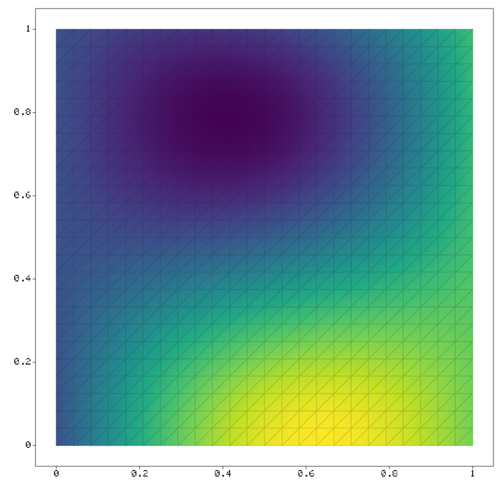

# Rendering a piecewise linear finite element field

draw_cg1_field renders a CG1 (piecewise linear) nodal field on a
triangulation through the viridis colormap. The PNG backend interpolates
the field value barycentrically at every pixel and applies the colormap
there, so the colormap curve is followed exactly even on coarse meshes.
Here: f(x, y) = sin(3x) cos(4y) + x on a 24 x 24 triangulation of the
unit square, with the mesh wireframe overlaid.

## Program

```cpp
#include <cstdio>
#include <random>

#include "etree/etree.hpp"
#include "etree/plot2d.hpp"

using namespace etree;

int main()
{
    const int m = 24;
    Eigen::MatrixXd vertices(2, (m + 1) * (m + 1));
    for ( int jj = 0; jj <= m; ++jj )
    {
        for ( int ii = 0; ii <= m; ++ii )
        {
            vertices.col(jj * (m + 1) + ii) = Eigen::Vector2d(ii / double(m), jj / double(m));
        }
    }
    Eigen::MatrixXi cells(3, 2 * m * m);
    int cc = 0;
    for ( int jj = 0; jj < m; ++jj )
    {
        for ( int ii = 0; ii < m; ++ii )
        {
            const int v00 = jj * (m + 1) + ii;
            const int v10 = v00 + 1;
            const int v01 = v00 + (m + 1);
            const int v11 = v01 + 1;
            cells.col(cc++) = Eigen::Vector3i(v00, v10, v11);
            cells.col(cc++) = Eigen::Vector3i(v00, v11, v01);
        }
    }
    SimplexMesh mesh(vertices, cells);

    Eigen::VectorXd f(vertices.cols());
    for ( int vv = 0; vv < vertices.cols(); ++vv )
    {
        f(vv) = std::sin(3.0 * vertices(0, vv)) * std::cos(4.0 * vertices(1, vv)) + vertices(0, vv);
    }
    std::printf("field range: [%.3f, %.3f] on %d vertices\n", f.minCoeff(), f.maxCoeff(),
                mesh.num_vertices());

    Plot2D fig;
    FieldOptions opts;
    opts.wireframe = true;
    draw_cg1_field(fig, mesh, f, opts);
    fig.save_png("cg1_field.png", 820);
    return 0;
}
```

## Output

```text
field range: [-0.532, 1.579] on 625 vertices
```

## Figures



---

*This page is generated by `docs/generate_examples.py` from [`examples/cg1_field.cpp`](../../examples/cg1_field.cpp); the output and figures above are produced by actually running it.*
