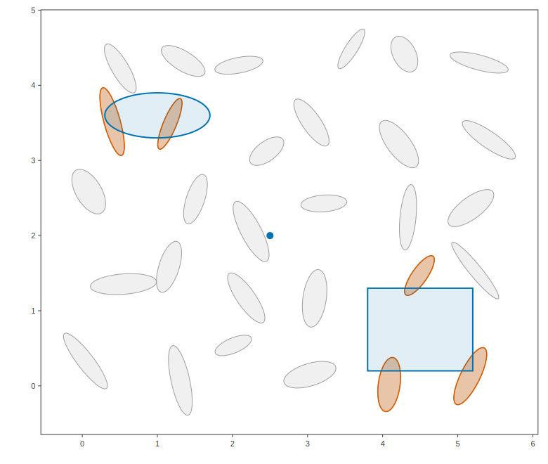

# EllipsoidTree: spatial queries against a family of ellipsoids

An EllipsoidTree indexes a family of ellipsoids (at a fixed scale tau) and
answers "which ellipsoids intersect this query object?" for every object
type in the library. Here: a point query, a box query, and an ellipsoid
query against a jittered grid of anisotropic ellipsoids. Hit ellipsoids
are drawn in vermillion, queries in blue.

## Program

```cpp
#include <algorithm>
#include <cstdio>
#include <random>

#include "etree/etree.hpp"
#include "etree/plot2d.hpp"

using namespace etree;

namespace {

void print_hits( const char* label, std::vector<int> hits )
{
    std::sort(hits.begin(), hits.end());
    std::printf("%-18s ->", label);
    for ( int idx : hits )
    {
        std::printf(" %d", idx);
    }
    std::printf("\n");
}

} // end anonymous namespace

int main()
{
    // 6 x 5 grid of ellipsoids with deterministic jitter and orientations
    std::mt19937 gen(3);
    auto uniform = [&]() { return gen() / 4294967296.0; };
    std::vector<Ellipsoid> family;
    for ( int jj = 0; jj < 5; ++jj )
    {
        for ( int ii = 0; ii < 6; ++ii )
        {
            Eigen::Vector2d mu(ii + 0.6 * uniform(), jj + 0.6 * uniform());
            const double th = 3.1416 * uniform();
            Eigen::Matrix2d R;
            R << std::cos(th), -std::sin(th),
                 std::sin(th),  std::cos(th);
            const double a = 0.25 + 0.25 * uniform();
            const double b = 0.08 + 0.10 * uniform();
            family.push_back(Ellipsoid{mu, R * Eigen::Vector2d(a * a, b * b).asDiagonal() * R.transpose()});
        }
    }
    EllipsoidTree tree(family, /*tau=*/1.0);

    Eigen::Vector2d query_point(2.5, 2.0);
    Box             query_box{Eigen::Vector2d(3.8, 0.2), Eigen::Vector2d(5.2, 1.3)};
    Ellipsoid       query_ellipsoid{Eigen::Vector2d(1.0, 3.6),
                                    Eigen::Vector2d(0.49, 0.09).asDiagonal()};

    std::vector<int> point_hits = tree.collisions(query_point);
    std::vector<int> box_hits   = tree.collisions(query_box);
    std::vector<int> ell_hits   = tree.collisions(query_ellipsoid);

    print_hits("point query", point_hits);
    print_hits("box query", box_hits);
    print_hits("ellipsoid query", ell_hits);

    Plot2D fig;
    DrawTreeOptions opts;
    opts.node_boxes   = false;
    opts.object_style = Style{colors::gray(), 1.0, with_alpha(colors::gray(), 0.15)};
    draw_tree(fig, tree, opts);
    const Style hit{colors::vermillion(), 1.6, with_alpha(colors::vermillion(), 0.3)};
    draw_elements(fig, tree, point_hits, hit);
    draw_elements(fig, tree, box_hits, hit);
    draw_elements(fig, tree, ell_hits, hit);
    const Style q{colors::blue(), 2.0, with_alpha(colors::blue(), 0.12)};
    fig.add_marker(query_point, 5.0, Style{colors::transparent(), 0.0, colors::blue()});
    fig.add(query_box, q);
    fig.add(query_ellipsoid, 1.0, q);
    fig.save_svg("tree_queries.svg", 780);
    return 0;
}
```

## Output

```text
point query        ->
box query          -> 4 5 10
ellipsoid query    -> 18 19
```

## Figures



---

*This page is generated by `docs/generate_examples.py` from [`examples/ellipsoid_tree_queries.cpp`](../../examples/ellipsoid_tree_queries.cpp); the output and figures above are produced by actually running it.*
