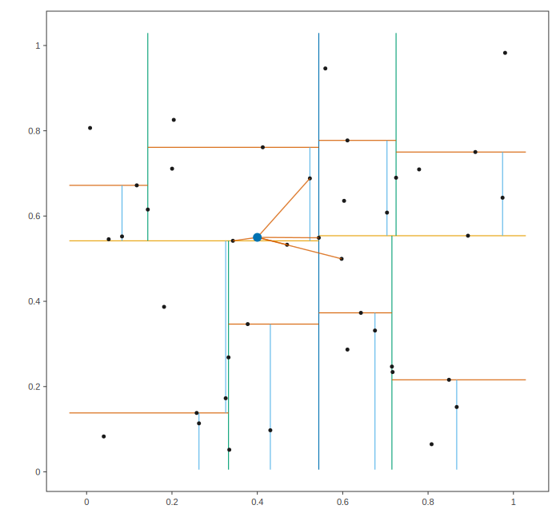

# KDTree: k nearest neighbors, and the partition behind them

The kd-tree recursively splits the point cloud by median coordinates,
alternating axes; each splitting line in the figure passes through the
median point that defines that internal node, clipped to its parent's
region, colored by depth. The query point is the large blue marker, and
segments connect it to its five nearest neighbors.

## Program

```cpp
#include <cstdio>
#include <random>

#include "etree/etree.hpp"
#include "etree/plot2d.hpp"

using namespace etree;

int main()
{
    // A deterministic cloud of 40 points in [0, 1]^2
    std::mt19937 gen(19);
    auto uniform = [&]() { return gen() / 4294967296.0; };
    Eigen::MatrixXd points(2, 40);
    for ( int ii = 0; ii < 40; ++ii )
    {
        points.col(ii) = Eigen::Vector2d(uniform(), uniform());
    }

    KDTree tree;
    tree.block_size = 1; // split all the way down (nicer to look at)
    tree.build(points);

    Eigen::Vector2d query(0.4, 0.55);
    auto [inds, dsqs] = tree.query(query, 5);
    std::printf("the 5 nearest neighbors of (%.2f, %.2f) are:\n", query(0), query(1));
    for ( int kk = 0; kk < 5; ++kk )
    {
        std::printf("  point %2d at (%.3f, %.3f), distance %.4f\n",
                    inds(kk, 0), points(0, inds(kk, 0)), points(1, inds(kk, 0)),
                    std::sqrt(dsqs(kk, 0)));
    }

    Plot2D fig;
    DrawKDTreeOptions opts;
    opts.max_depth = 4;
    draw_kdtree(fig, tree, opts);
    for ( int kk = 0; kk < 5; ++kk )
    {
        fig.add(Segment{query, points.col(inds(kk, 0))},
                Style{with_alpha(colors::vermillion(), 0.8), 1.4, colors::transparent()});
    }
    fig.add_marker(query, 5.5, Style{colors::transparent(), 0.0, colors::blue()});
    fig.save_svg("kdtree_knn.svg", 700);
    return 0;
}
```

## Output

```text
the 5 nearest neighbors of (0.40, 0.55) are:
  point 36 at (0.343, 0.542), distance 0.0578
  point 17 at (0.470, 0.533), distance 0.0717
  point 11 at (0.544, 0.549), distance 0.1440
  point 19 at (0.523, 0.688), distance 0.1852
  point 15 at (0.597, 0.500), distance 0.2038
```

## Figures



---

*This page is generated by `docs/generate_examples.py` from [`examples/kdtree_knn.cpp`](../../examples/kdtree_knn.cpp); the output and figures above are produced by actually running it.*
