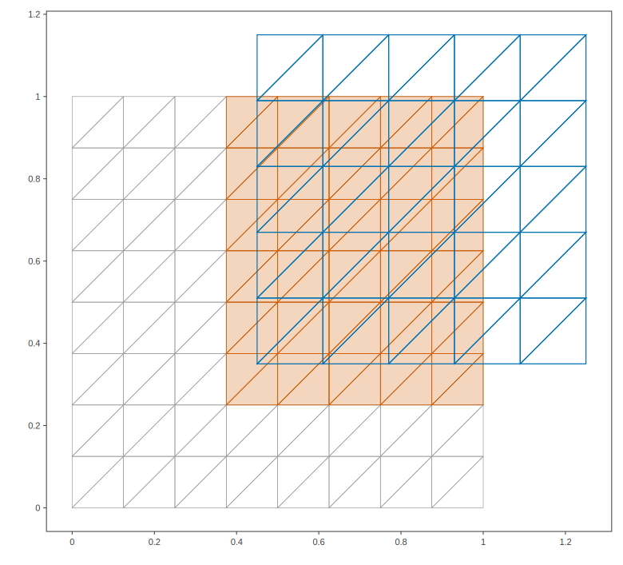

# Mesh vs mesh: all intersecting cell pairs between two meshes

cell_pairs finds every (cell of A, cell of B) pair whose closed cells
intersect, by simultaneous descent over both cell trees with the
simplex-simplex LP as the narrow phase. This is the geometric kernel of
supermeshing and conservative field transfer between non-matching meshes.
Mesh A is gray; mesh B (shifted, scaled, and coarser) is blue; cells of A
that intersect at least one cell of B are shaded.

## Program

```cpp
#include <cstdio>
#include <algorithm>
#include <set>

#include "ellipsoid_tree/ellipsoid_tree.hpp"
#include "ellipsoid_tree/plot2d.hpp"

using namespace ellipsoid_tree;

namespace {

std::pair<Eigen::MatrixXd, Eigen::MatrixXi> unit_square_mesh( int m )
{
    Eigen::MatrixXd vertices(2, (m + 1) * (m + 1));
    for ( int jj = 0; jj <= m; ++jj )
    {
        for ( int ii = 0; ii <= m; ++ii )
        {
            vertices.col(jj * (m + 1) + ii) = Eigen::Vector2d(ii / double(m), jj / double(m));
        }
    }
    Eigen::MatrixXi cells(3, 2 * m * m);
    int cc = 0;
    for ( int jj = 0; jj < m; ++jj )
    {
        for ( int ii = 0; ii < m; ++ii )
        {
            const int v00 = jj * (m + 1) + ii;
            const int v10 = v00 + 1;
            const int v01 = v00 + (m + 1);
            const int v11 = v01 + 1;
            cells.col(cc++) = Eigen::Vector3i(v00, v10, v11);
            cells.col(cc++) = Eigen::Vector3i(v00, v11, v01);
        }
    }
    return {vertices, cells};
}

} // end anonymous namespace

int main()
{
    auto [vertices_a, cells_a] = unit_square_mesh(8);
    SimplexMesh mesh_a(vertices_a, cells_a);

    // Mesh B: coarser, scaled by 0.8, shifted into the upper right
    auto [vertices_b, cells_b] = unit_square_mesh(5);
    Eigen::MatrixXd shifted = (0.8 * vertices_b).colwise() + Eigen::Vector2d(0.45, 0.35);
    SimplexMesh mesh_b(shifted, cells_b);

    std::vector<std::pair<int, int>> pairs = mesh_a.cell_pairs(mesh_b);
    std::printf("mesh A has %d cells, mesh B has %d cells\n", mesh_a.num_cells(), mesh_b.num_cells());
    std::printf("%d intersecting (A, B) cell pairs; the first five are:", static_cast<int>(pairs.size()));
    std::sort(pairs.begin(), pairs.end());
    for ( int ii = 0; ii < 5; ++ii )
    {
        std::printf(" (%d,%d)", pairs[ii].first, pairs[ii].second);
    }
    std::printf("\n");

    std::set<int> touched_a;
    for ( const std::pair<int, int>& pr : pairs )
    {
        touched_a.insert(pr.first);
    }
    std::printf("%d cells of A intersect at least one cell of B\n",
                static_cast<int>(touched_a.size()));

    Plot2D fig;
    DrawTreeOptions gray;
    gray.node_boxes   = false;
    gray.object_style = Style{colors::gray(), 0.7, colors::transparent()};
    draw_tree(fig, mesh_a.cell_tree(), gray);
    draw_elements(fig, mesh_a.cell_tree(), std::vector<int>(touched_a.begin(), touched_a.end()),
                  Style{colors::vermillion(), 0.8, with_alpha(colors::vermillion(), 0.25)});
    DrawTreeOptions blue;
    blue.node_boxes   = false;
    blue.object_style = Style{colors::blue(), 1.2, colors::transparent()};
    draw_tree(fig, mesh_b.cell_tree(), blue);
    fig.save_svg("mesh_mesh.svg", 780);
    return 0;
}
```

## Output

```text
mesh A has 128 cells, mesh B has 50 cells
197 intersecting (A, B) cell pairs; the first five are: (38,0) (39,0) (39,1) (40,0) (40,2)
60 cells of A intersect at least one cell of B
```

## Figures



---

*This page is generated by `docs/generate_examples.py` from [`examples/mesh_mesh.cpp`](../../examples/mesh_mesh.cpp); the output and figures above are produced by actually running it.*
