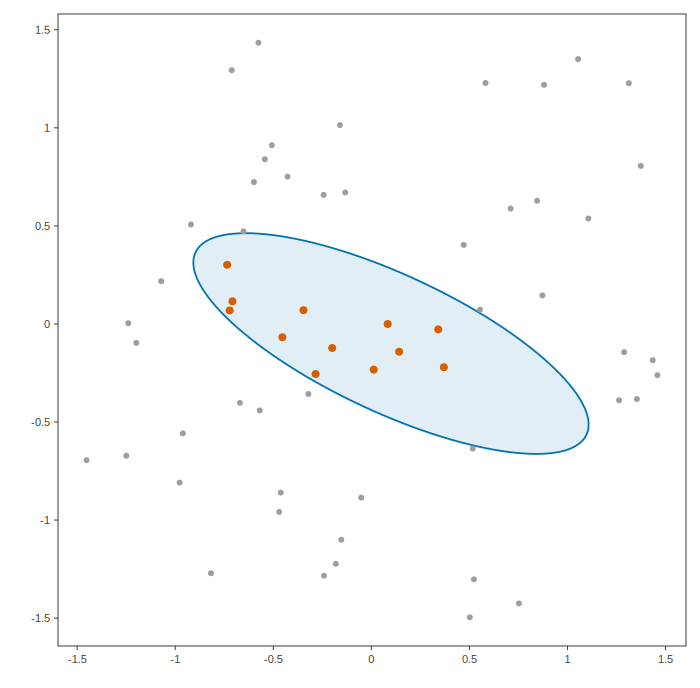

# Which points of a cloud does an ellipsoid cover?

A point cloud is a BallTree with zero radii: build the tree once, then ask
which points lie inside a query ellipsoid. The broad phase prunes with the
tree's boxes and the tiered exact ellipsoid-box test; the narrow phase is
the Mahalanobis membership test. Covered points are drawn in vermillion.

## Program

```cpp
#include <algorithm>
#include <cstdio>
#include <random>

#include "ellipsoid_tree/ellipsoid_tree.hpp"
#include "ellipsoid_tree/plot2d.hpp"

using namespace ellipsoid_tree;

int main()
{
    // A deterministic pseudo-random cloud of 60 points in [-1.5, 1.5]^2
    std::mt19937 gen(7);
    auto uniform = [&]() { return 3.0 * (gen() / 4294967296.0) - 1.5; };
    Eigen::MatrixXd points(2, 60);
    for ( int ii = 0; ii < 60; ++ii )
    {
        points.col(ii) = Eigen::Vector2d(uniform(), uniform());
    }
    BallTree cloud(points, Eigen::VectorXd::Zero(60));

    // A tilted ellipsoid: mu, Sigma = R diag(1.1^2, 0.35^2) R^T at -25 degrees
    const double th = -0.4363;
    Eigen::Matrix2d R;
    R << std::cos(th), -std::sin(th),
         std::sin(th),  std::cos(th);
    Ellipsoid E{Eigen::Vector2d(0.1, -0.1),
                R * Eigen::Vector2d(1.21, 0.1225).asDiagonal() * R.transpose()};

    std::vector<int> covered = cloud.collisions(E, 1.0);
    std::sort(covered.begin(), covered.end());

    std::printf("%d of %d points are covered by the ellipsoid:\n",
                static_cast<int>(covered.size()), cloud.size());
    for ( int idx : covered )
    {
        std::printf("  point %2d at (%+.3f, %+.3f)\n", idx, points(0, idx), points(1, idx));
    }

    Plot2D fig;
    fig.add(E, 1.0, Style{colors::blue(), 1.8, with_alpha(colors::blue(), 0.12)});
    for ( int ii = 0; ii < cloud.size(); ++ii )
    {
        fig.add_marker(points.col(ii), 3.0, Style{colors::transparent(), 0.0, colors::gray()});
    }
    for ( int idx : covered )
    {
        fig.add_marker(points.col(idx), 4.0, Style{colors::transparent(), 0.0, colors::vermillion()});
    }
    fig.save_svg("covered_points.svg", 700);
    return 0;
}
```

## Output

```text
12 of 60 points are covered by the ellipsoid:
  point  5 at (-0.708, +0.115)
  point  9 at (+0.083, -0.000)
  point 20 at (-0.735, +0.302)
  point 26 at (-0.346, +0.070)
  point 31 at (+0.341, -0.028)
  point 33 at (-0.454, -0.068)
  point 40 at (+0.142, -0.141)
  point 44 at (-0.200, -0.123)
  point 50 at (+0.012, -0.233)
  point 51 at (+0.370, -0.221)
  point 53 at (-0.723, +0.069)
  point 54 at (-0.284, -0.255)
```

## Figures



---

*This page is generated by `docs/generate_examples.py` from [`examples/point_cloud.cpp`](../../examples/point_cloud.cpp); the output and figures above are produced by actually running it.*
